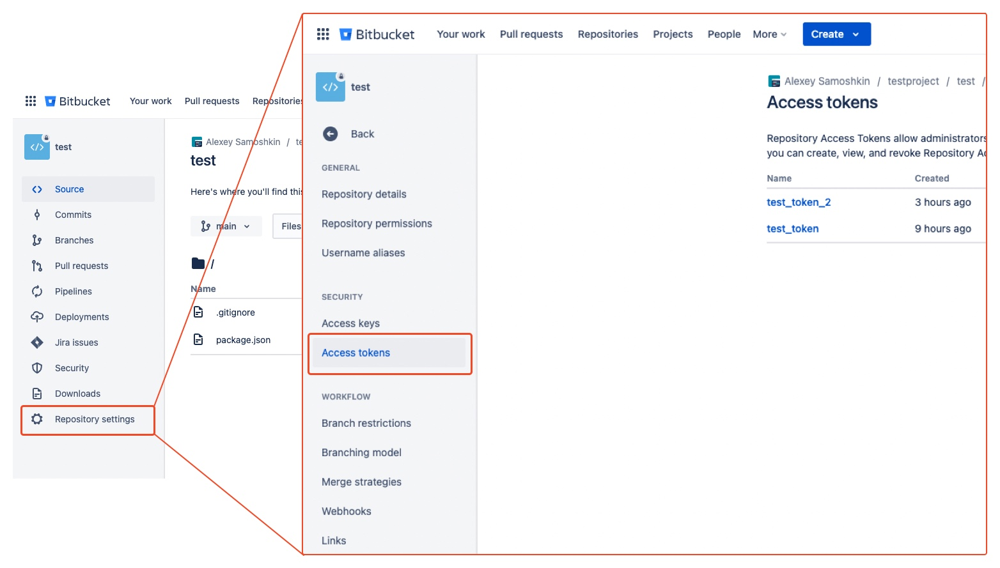

# vcs-automation-scripts

The CLI tool, that allows to upgrade specific library version in project package.json (dependencies, devDependencies, peerDepedencies), and open a pull request.

## Usage

This project relies on node@18. If you're using `nvm`, there's an `.nvmrc` in repo root.

```sh
# switch to the right Node version (if using NVM), otherwise make sure the correct Node version on your own
nvm use

# build
npm run build

# run
export BITBUCKET_ACCESS_TOKEN="<your_access_token>"
node ./dist/main.js --library <library_name> --library-version <library_version> --workspace <bitbucket_workspace> --reposlug <bitbucket_reposlug>
```

CLI arguments:

- `--library`, the library name that you would like to upgrade
- `--libraryVersion`, the desired library version
- `--workspace`, Bitbucket workspace (e.g alexey_samoshkin)
- `--reposlug`, Bitbucket reposlug (e.g. test)


### How to obtain Bitbucket access token

Make sure to provide Bitbucket access token via `BITBUCKET_ACCESS_TOKEN` variable. It should be a repository-level access token. Navigate to "Repository Settings => Access tokens" menu.


